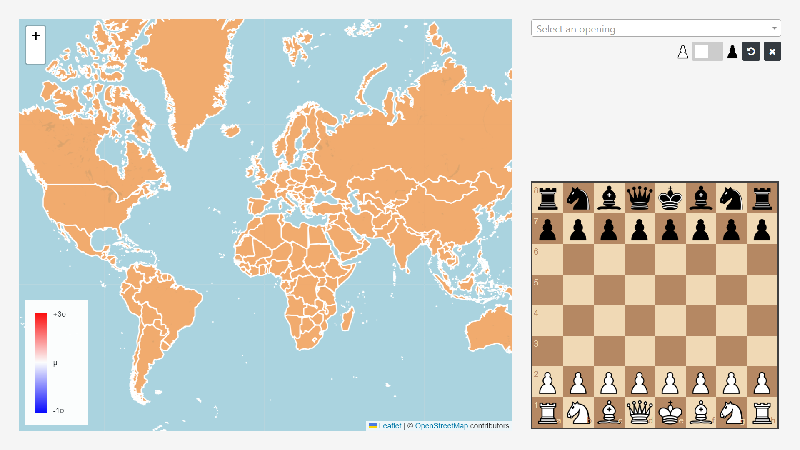

# Map of Online Chess

## Preparation
### Packages
Use the requirements file to install necessary packages with your package manager of choice. E.g.
```
pip install -r requirements.txt
```

### Data preparation
The make command `data_preparation` runs the required commands to prepare the geoJSON and player data on Linux systems.
Simply run the following command:
- `COUNTRY_PARQUET`: Name of the .parquet-file with openings per country (In the [data/output/countries](data/output/countries) directory)
- `USER_AGENT`: User agent to use with Nominatim (e.g. your mail-address)

```
make prepare_data  COUNTRY_PARQUET=test_openings.parquet USER_AGENT='[NAME]@[MAIL_SERVICE]'
```

For the detailed steps on other operating systems, please refer to the instructions below.


### Detailed data preparation
#### Map data
Download the geoJSON from [datahub](https://datahub.io/core/geo-countries) to [`./map/static/json`](map/static/json) using the name `countries.geojson`.
On Linux, for instance, run:
```
wget -O ./map/static/json/countries.geojson https://datahub.io/core/geo-countries/r/countries.geojson
```

#### Get country information for players
Run the following make command with the required arguments:
- `COUNTRY_PARQUET`: Name of the .parquet-file with openings per country (In the [data/output/countries](data/output/countries) directory)
- `USER_AGENT`: User agent to use with Nominatim (e.g. your mail-address)

```
make parse_countries COUNTRY_PARQUET=test_openings.parquet USER_AGENT='[NAME]@[MAIL_SERVICE]'
```

#### Add the player counts to each country
After downloading the `countries.geojson` file and parsing the country information for each player, run the following command to add player counts to each country in the geoJSON file:
- `COUNTRY_PARQUET`: Name of the .parquet-file with openings per country (In the [data/output/countries](data/output/countries) directory)
```
make enrich_geojson COUNTRY_PARQUET=test_cleaned.parquet
```

#### Install JavaScript Dependencies
Make sure to have npm installed (https://www.npmjs.com/). Install the dependencies specified in package.json:
```
npm i
```
